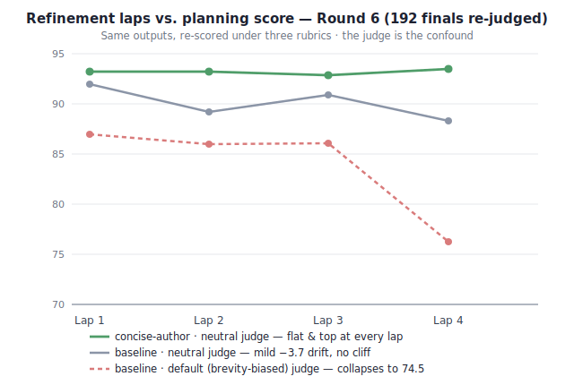

# windtunnel

Local benchmarking across Nvidia and Intel consumer hardware — planning-quality experiments run on idle
electricity instead of frontier API tokens. This repo houses the **Matrix Wind-Tunnel**: does self-refinement
(planner ↔ critic laps) actually improve LLM planning output, and does it depend on the model, the prompt, or
the judge scoring it?

Full living lab log (styled, byte-for-byte source of record): **[MATRIX-WIND-TUNNEL-LOG.html](MATRIX-WIND-TUNNEL-LOG.html)**
This README is a navigable summary of the same six rounds of experiments.

## Bottom line

> Six rounds of idle-hardware experiments on refinement laps for planning, ending with a confound check that
> rewrote the conclusion.

- **Lap count barely matters** under fair (length-neutral) judging — quality sits ~87–92 across 1–4 laps. The
  early "laps hurt → 2 laps best → over-refinement collapse" arc was largely an artifact of the default
  judge's brevity bias.
- **The one robust, real effect: a concise author system prompt** ("shortest complete answer; lead with the
  decision") — a small (~+3) but consistent edge that survives every judge and stays flat across laps.
- **Biggest lesson — the judge is a first-order confound.** A single LLM judge's rubric shaped the results
  more than the thing under test. LLM-scored agent work needs multi-rubric / multi-judge scoring, or the
  numbers measure the ruler.

The value wasn't the answer about laps (it's "meh") — it was the method: the wind tunnel flagged an effect,
corrected it, explained it, then caught its own measurement bias. All on idle local hardware, overnight.

## Contents

- [What we built (the instrument)](#what-we-built-the-instrument)
- [The experiment](#the-experiment)
- [Finding 1 — refinement is not a free win](#finding-1--refinement-is-not-a-free-win-superseded)
- [Finding 2 — the effect is task-dependent](#finding-2--the-effect-is-task-dependent-but-never-positive)
- [Finding 3 — the critic never converged](#finding-3--the-critic-never-converged)
- [Confirmation sweep](#confirmation-sweep-36-cells)
- [Round 3 — dedicated planner ↔ critic](#round-3--a-dedicated-plannercritic-doesnt-flip-it-either)
- [Round 4 — the larger matrix flips it](#round-4--the-larger-matrix-flips-it-2-laps-is-the-sweet-spot)
- [Hardware finding — 32GB DDR4 is the binding constraint](#hardware-finding--32gb-ddr4-is-the-binding-constraint-not-vram)
- [Round 5 — over-refinement is a prompt artifact](#round-5--the-over-refinement-collapse-is-a-prompt-artifact-not-a-law)
- [Round 6 — the judge was a confound](#round-6--the-judge-was-a-confound-the-effect-is-real-but-smaller)
- [What this changes](#what-this-changes)
- [Open threads](#open-threads)

## What we built (the instrument)

**Commander intent lane** — a local author ↔ critic refine loop that takes frontier models *out* of the run
loop (ADR-0012). The cell engine of the matrix.

**Matrix dataset harness** — per-role backend routing so planner and critic run on *different boxes*, plus a
held-out critic-panel scorer and dataset. Each cell = `(planner × critic × prompt × laps × ordering)` → a
scored proposal. Fully offline-testable; the AM4/OMEN legs run live.

## The experiment

The commander lane defaults to `rounds=3` refinement laps on the assumption more refinement = better. Is that
true for *planning* tasks — and does it depend on which model plans vs. critiques, and on the task?

| Axis | Values |
|---|---|
| Planner / critic | AM4 `Qwen3-30B-A3B` (dual-Intel-B70, :8080 via oxen facade) · OMEN `qwen3-coder:30b` |
| Ordering | AM4→OMEN (AM4 plans, OMEN critiques) · OMEN→AM4 (reverse) |
| Prompt | choose-next-agent · escalate-or-not · plan-skeleton (+3 more archetypes from Round 4) |
| Laps | 1–4 self-refinement rounds |
| Score | held-out judge panel (OMEN `qwen3-coder:30b`), 0–100 rubric |

## Finding 1 — refinement is not a free win *(superseded)*

> Superseded by Round 4 (2 laps wins). Kept for the honest arc.

Across a 12-cell pilot, 3 laps scored lower than 1 lap for both planners.

| Planner | 1 lap | 3 laps | Δ |
|---|--:|--:|--:|
| AM4 Qwen3-30B | 85.0 | 74.0 | −11.0 |
| OMEN qwen3-coder:30b | 80.7 | 78.3 | −2.4 |
| **overall** | **82.8** | **76.2** | **−6.6** |

## Finding 2 — the effect is task-dependent (but never positive)

> Revised by the n=12 sweep below — the apparent "+5 at escalate-or-not" was noise.

| Prompt | 1 lap | 3 laps | Verdict |
|---|--:|--:|---|
| choose-next-agent | 80.0 | 65.0 | refinement HURT (−15) |
| escalate-or-not | 83.5 | 88.5 | refinement HELPED (+5, later shown flat) |
| plan-skeleton | 85.0 | 75.0 | refinement HURT (−10) |

## Finding 3 — the critic never converged

`converged=False` on **all 12 pilot cells** — the critic never emitted `VERDICT: CONVERGED`, so every cell
burned its full lap budget. The lap *cap*, not convergence, was the real control knob.

## Confirmation sweep (36 cells)

Laps {1,2,3} × 3 prompts × both orderings × 2 repeats = 36 cells. The pilot's effect replicated and sharpened
— a **monotonic decline** (L1 > L2 > L3), not U-shaped.

| Laps | Mean (n=12) |
|---|--:|
| 1 | **82.2** |
| 2 | 81.4 |
| 3 | 77.2 |

## Round 3 — a dedicated planner↔critic doesn't flip it either

Purpose-built asymmetric loop: **Qwen3-30B planner ↔ Qwen2.5-14B critic**, OMEN as held-out judge.

| Laps | Mean (n=6) |
|---|--:|
| 1 | **84.5** |
| 2 | 81.3 |
| 3 | 81.8 |

Still no win for refinement — "1 lap is best" held even with a dedicated critic.

## Round 4 — the larger matrix flips it: 2 laps is the sweet spot

> **AUTHORITATIVE at the time · 48/48 cells, 6 prompts, n=12/lap** — later recalibrated by Round 6.

Doubling task coverage to 6 planning archetypes overturned the preliminary finding — the curve is an
**inverted-U peaking at 2 laps**:

| Laps | Mean (n=12) |
|---|--:|
| 1 | 81.2 |
| 2 | **86.2** |
| 3 | 82.6 |
| 4 | 75.9 |

## Hardware finding — 32GB DDR4 is the binding constraint, not VRAM

The B70s hold 64GB VRAM total, but AM4 has only **32GB DDR4 host RAM**. SYCL llama-server keeps host-side
KV + compute buffers even with `-ngl 99`; co-loading a 30B planner + 14B critic at generous contexts
OOM-killed the planner mid-run. Dropping the critic 32k→8k ctx freed ~7 GiB and restored headroom.
Runbook: `B70-CARD-MANAGEMENT.md` (mechnet repo).

## Round 5 — the over-refinement collapse is a prompt artifact, not a law

> **AUTHORITATIVE at the time · 192/192 cells, n=12/arm·lap**

Swept 4 prompt-variant arms across the full grid to test whether the L3–L4 collapse was inherent to refining
or a symptom of the critic prompt pushing bloat that the judge then penalized.

| Arm (what it changes) | L1 | L2 | L3 | L4 | Overall |
|---|--:|--:|--:|--:|--:|
| baseline | 85.2 | 84.2 | 84.3 | 74.5 | 82.1 |
| **minimalist-critic** (reward brevity) | 88.8 | 86.8 | 86.2 | 86.5 | 87.1 |
| thorough-critic (demand coverage) | 84.5 | 80.3 | 79.2 | 76.8 | 80.2 |
| **concise-author** (shortest complete) | 91.4 | 90.8 | 88.0 | 90.2 | **90.1** |

The collapse is prompt-driven: `minimalist-critic` stays flat (~86, no collapse); `concise-author` dominates
and is immune to over-refinement. A follow-up (72/72 cells, laps 1–6) confirmed the stacked winners hold
flat-high (~89–91) across all six laps while baseline degrades and gets erratic.

## Round 6 — the judge was a confound; the effect is real but smaller

> **Honest caveat · 192 finals re-judged, no regeneration, same outputs**

Before trusting Round 5: the score came from one judge (OMEN `qwen3-coder`) whose rubric rewarded
directness. Re-judged all 192 finals under two alternative rubrics.

| Arm | Default (directness) | Completeness judge | Neutral judge |
|---|--:|--:|--:|
| baseline | 82.1 | 90.4 | 88.1 |
| **concise-author** | 90.1 | 90.2 | **90.9** |
| minimalist-critic | 87.1 | 89.1 | 89.8 |
| thorough-critic | 80.2 | 90.3 | 88.0 |

- **The finding survives** — concise-author still wins under the neutral judge, but the effect was
  **inflated ~3×** (default judge: +8 lead → neutral judge: +2.8 lead).
- **The completeness judge collapses the spread** — baseline and thorough-critic jump from ~81 → ~90, showing
  much of the "over-refinement collapse" was the default judge penalizing verbosity, not real quality loss.
- Re-judged per lap under the neutral rubric, baseline shows a mild −3.7 drift (no cliff); concise-author is
  dead flat and top at every lap. See the chart above.

**Meta-lesson:** the judge rubric is a first-order confound — the Round 4–5 "inverted-U / collapse" was
mostly the instrument. This lands directly on any lab's belief/assay layer: LLM-scored agent work needs
multi-rubric judging, or the scores measure the ruler as much as the work.

## What this changes

- **A concise author prompt is a real, modest win** (~+3 under a fair judge, not the +8 the default judge
  suggested). Worth doing; not a silver bullet.
- **Lap count matters less than it first looked** — don't hard-cap laps on the collapse alone; a concise
  author + a fair judge is the better fix.
- **The biggest takeaway is about measurement, not laps** — the judge rubric inflated every effect ~3×.
  Judge-robustness (multi-rubric / multi-judge) belongs in any evaluation pipeline that scores agent work
  with LLMs.
- The matrix earned its keep four times: found an effect → corrected it → explained it → caught its own
  measurement bias. That last step is the one most experiments skip.

## Open threads

- Back the second AM4 critic slot (gguf + launcher) → full 2-AM4-model grid.
- Bigger sweep for statistical confidence if the 36-cell run is suggestive but not decisive.
- Fix the knowledge-guard bug blocking catalog/capacity queries during scheduling.

---

**Provenance:** harness `hearth/experiments/` + `hearth/commander/`. Pilot dataset
`matrix-20260706T052819Z-pilot` (12/12 ok), confirmation sweep `matrix-20260706T063613Z-sweep-r2` (36/36 ok).
AM4 native Ubuntu, planner co-resident with idle ComfyUI; OMEN `qwen3-coder:30b` as held-out judge across
rounds. Two-economies doctrine — every lap ran on otherwise-idle electricity.
