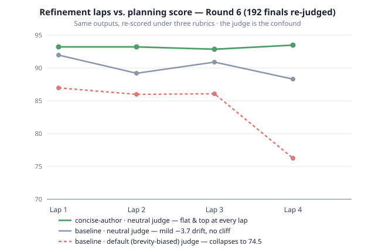

# windtunnel

Local benchmarking across Nvidia and Intel consumer hardware — controlled experiments run on idle electricity
instead of frontier API tokens. **Two wind tunnels live here, and they found the same thing one level apart:**

- **The Matrix Wind-Tunnel** — does self-refinement (planner ↔ critic laps) actually improve LLM planning
  output, and does it depend on the model, the prompt, or the judge scoring it? Six rounds, ending with the
  discovery that the **judge** shaped the results more than the thing under test.
- **[The hardware wind tunnel](#the-hardware-wind-tunnel--the-same-confound-one-level-down)** — the same method pointed at the
  machines this lab benchmarks *on*. Five of its own headline hardware numbers went back through the tunnel;
  **none survived unchanged**, and the culprit was again the instrument, not the subject.

> **From [autoreason PR #2](https://github.com/NousResearch/autoreason/pull/2)?** Start with
> **[windtunnel → autoreason](AUTOREASON.md)** — what this generalized local-testing lab is, and how it supports
> the initiative (then hop to the crossover map, the runnable apparatus, and the recommendations).

> **Want to build the instrument yourself?** The **[HEARTH workbook](workbook/)** (styled:
> [HEARTH-WORKBOOK.html](https://djcdevelopment.github.io/windtunnel/HEARTH-WORKBOOK.html)) is a ~90-minute guide
> to the always-on local MCP gateway this lab's harness descends from: every agent tool call logged to a JSONL
> manifest, grunt work offloaded from your frontier agent to your own GPU. One Python file, checkpoints at every
> step, the traps included.

Full living lab log (styled, byte-for-byte source of record): **[MATRIX-WIND-TUNNEL-LOG.html](https://djcdevelopment.github.io/windtunnel/MATRIX-WIND-TUNNEL-LOG.html)**
This README is a navigable summary of the same six rounds — plus the hardware round that followed them.

## Bottom line

> Six rounds of idle-hardware experiments on refinement laps for planning, ending with a confound check that
> rewrote the conclusion.

- **Lap count barely matters** under fair (length-neutral) judging — quality sits ~87–92 across 1–4 laps. The
  early "laps hurt → 2 laps best → over-refinement collapse" arc was largely an artifact of the default
  judge's brevity bias.
- **The one robust, real effect: a concise author system prompt** ("shortest complete answer; lead with the
  decision") — a small (~+3) but consistent edge that survives every judge and stays flat across laps.
- **Biggest lesson — the judge is a first-order confound.** A single LLM judge's rubric shaped the results
  more than the thing under test. LLM-scored agent work needs multi-rubric / multi-judge scoring, or the
  numbers measure the ruler.

The value wasn't the answer about laps (it's "meh") — it was the method: the wind tunnel flagged an effect,
corrected it, explained it, then caught its own measurement bias. All on idle local hardware, overnight.

> **The sequel is one layer down.** Six weeks later the same method was pointed at the *hardware* this lab
> benchmarks on. Five of its own headline numbers went back through the tunnel and **none survived**: one
> refuted, one corrected, one mislabeled, one refuted-and-reassigned, one located and found to be
> model-specific. See **[the hardware wind tunnel](#the-hardware-wind-tunnel--the-same-confound-one-level-down)**.

## Contents

- [What we built (the instrument)](#what-we-built-the-instrument)
- [The experiment](#the-experiment)
- [Finding 1 — refinement is not a free win](#finding-1--refinement-is-not-a-free-win-superseded)
- [Finding 2 — the effect is task-dependent](#finding-2--the-effect-is-task-dependent-but-never-positive)
- [Finding 3 — the critic never converged](#finding-3--the-critic-never-converged)
- [Confirmation sweep](#confirmation-sweep-36-cells)
- [Round 3 — dedicated planner ↔ critic](#round-3--a-dedicated-plannercritic-doesnt-flip-it-either)
- [Round 4 — the larger matrix flips it](#round-4--the-larger-matrix-flips-it-2-laps-is-the-sweet-spot)
- [Hardware finding — 32GB DDR4 is the binding constraint](#hardware-finding--32gb-ddr4-is-the-binding-constraint-not-vram)
- [Round 5 — over-refinement is a prompt artifact](#round-5--the-over-refinement-collapse-is-a-prompt-artifact-not-a-law)
- [Round 6 — the judge was a confound](#round-6--the-judge-was-a-confound-the-effect-is-real-but-smaller)
- [What this changes](#what-this-changes)
- [The hardware wind tunnel — the same confound, one level down](#the-hardware-wind-tunnel--the-same-confound-one-level-down)
- [Crossover — autoreason bilevel (PR #2)](#crossover--autoreason-bilevel-outer-loop-pr-2)
  · [recommendations & experiment plan](https://djcdevelopment.github.io/windtunnel/RECOMMENDATIONS.html)
- [Open threads](#open-threads)

## What we built (the instrument)

**Commander intent lane** — a local author ↔ critic refine loop that takes frontier models *out* of the run
loop (ADR-0012). The cell engine of the matrix.

**Matrix dataset harness** — per-role backend routing so planner and critic run on *different boxes*, plus a
held-out critic-panel scorer and dataset. Each cell = `(planner × critic × prompt × laps × ordering)` → a
scored proposal. Fully offline-testable; the AM4/OMEN legs run live.

## The experiment

The commander lane defaults to `rounds=3` refinement laps on the assumption more refinement = better. Is that
true for *planning* tasks — and does it depend on which model plans vs. critiques, and on the task?

| Axis | Values |
|---|---|
| Planner / critic | AM4 `Qwen3-30B-A3B` (dual-Intel-B70, :8080 via oxen facade) · OMEN `qwen3-coder:30b` |
| Ordering | AM4→OMEN (AM4 plans, OMEN critiques) · OMEN→AM4 (reverse) |
| Prompt | choose-next-agent · escalate-or-not · plan-skeleton (+3 more archetypes from Round 4) |
| Laps | 1–4 self-refinement rounds |
| Score | held-out judge panel (OMEN `qwen3-coder:30b`), 0–100 rubric |

> ⚠ **Rig provenance — this is the machine as it was, not as it is.** The two Intel B70s left the AM4 host in
> a 2026-08-20 rebuild and now run in OMEN under Windows; the `qwen3-coder:30b` Ollama endpoint and the oxen
> facade on `:8080` are both retired. Every number in Rounds 1–6 was measured on the rig described above and
> **stands as measured**. Nothing below has been re-run on the current hardware — and a re-run would not be a
> correction of it, only a fact about a different machine.

## Finding 1 — refinement is not a free win *(superseded)*

> Superseded by Round 4 (2 laps wins). Kept for the honest arc.

Across a 12-cell pilot, 3 laps scored lower than 1 lap for both planners.

| Planner | 1 lap | 3 laps | Δ |
|---|--:|--:|--:|
| AM4 Qwen3-30B | 85.0 | 74.0 | −11.0 |
| OMEN qwen3-coder:30b | 80.7 | 78.3 | −2.4 |
| **overall** | **82.8** | **76.2** | **−6.6** |

## Finding 2 — the effect is task-dependent (but never positive)

> Revised by the n=12 sweep below — the apparent "+5 at escalate-or-not" was noise.

| Prompt | 1 lap | 3 laps | Verdict |
|---|--:|--:|---|
| choose-next-agent | 80.0 | 65.0 | refinement HURT (−15) |
| escalate-or-not | 83.5 | 88.5 | refinement HELPED (+5, later shown flat) |
| plan-skeleton | 85.0 | 75.0 | refinement HURT (−10) |

## Finding 3 — the critic never converged

`converged=False` on **all 12 pilot cells** — the critic never emitted `VERDICT: CONVERGED`, so every cell
burned its full lap budget. The lap *cap*, not convergence, was the real control knob.

## Confirmation sweep (36 cells)

Laps {1,2,3} × 3 prompts × both orderings × 2 repeats = 36 cells. The pilot's effect replicated and sharpened
— a **monotonic decline** (L1 > L2 > L3), not U-shaped.

| Laps | Mean (n=12) |
|---|--:|
| 1 | **82.2** |
| 2 | 81.4 |
| 3 | 77.2 |

## Round 3 — a dedicated planner↔critic doesn't flip it either

Purpose-built asymmetric loop: **Qwen3-30B planner ↔ Qwen2.5-14B critic**, OMEN as held-out judge.

| Laps | Mean (n=6) |
|---|--:|
| 1 | **84.5** |
| 2 | 81.3 |
| 3 | 81.8 |

Still no win for refinement — "1 lap is best" held even with a dedicated critic.

## Round 4 — the larger matrix flips it: 2 laps is the sweet spot

> **AUTHORITATIVE at the time · 48/48 cells, 6 prompts, n=12/lap** — later recalibrated by Round 6.

Doubling task coverage to 6 planning archetypes overturned the preliminary finding — the curve is an
**inverted-U peaking at 2 laps**:

| Laps | Mean (n=12) |
|---|--:|
| 1 | 81.2 |
| 2 | **86.2** |
| 3 | 82.6 |
| 4 | 75.9 |

## Hardware finding — 32GB DDR4 is the binding constraint, not VRAM

> ⚠ **Historical — that configuration no longer exists.** This describes the AM4 host as it ran through July
> 2026. The constraint below was real on that machine; the cards moved hosts on 2026-08-20 and it does not
> bind the current one.

The B70s hold 64GB VRAM total, but AM4 has only **32GB DDR4 host RAM**. SYCL llama-server keeps host-side
KV + compute buffers even with `-ngl 99`; co-loading a 30B planner + 14B critic at generous contexts
OOM-killed the planner mid-run. Dropping the critic 32k→8k ctx freed ~7 GiB and restored headroom.
Runbook: `B70-CARD-MANAGEMENT.md` (mechnet repo).

## Round 5 — the over-refinement collapse is a prompt artifact, not a law

> **AUTHORITATIVE at the time · 192/192 cells, n=12/arm·lap**

Swept 4 prompt-variant arms across the full grid to test whether the L3–L4 collapse was inherent to refining
or a symptom of the critic prompt pushing bloat that the judge then penalized.

| Arm (what it changes) | L1 | L2 | L3 | L4 | Overall |
|---|--:|--:|--:|--:|--:|
| baseline | 85.2 | 84.2 | 84.3 | 74.5 | 82.1 |
| **minimalist-critic** (reward brevity) | 88.8 | 86.8 | 86.2 | 86.5 | 87.1 |
| thorough-critic (demand coverage) | 84.5 | 80.3 | 79.2 | 76.8 | 80.2 |
| **concise-author** (shortest complete) | 91.4 | 90.8 | 88.0 | 90.2 | **90.1** |

The collapse is prompt-driven: `minimalist-critic` stays flat (~86, no collapse); `concise-author` dominates
and is immune to over-refinement. A follow-up (72/72 cells, laps 1–6) confirmed the stacked winners hold
flat-high (~89–91) across all six laps while baseline degrades and gets erratic.

## Round 6 — the judge was a confound; the effect is real but smaller

> **Honest caveat · 192 finals re-judged, no regeneration, same outputs**

Before trusting Round 5: the score came from one judge (OMEN `qwen3-coder`) whose rubric rewarded
directness. Re-judged all 192 finals under two alternative rubrics.

| Arm | Default (directness) | Completeness judge | Neutral judge |
|---|--:|--:|--:|
| baseline | 82.1 | 90.4 | 88.1 |
| **concise-author** | 90.1 | 90.2 | **90.9** |
| minimalist-critic | 87.1 | 89.1 | 89.8 |
| thorough-critic | 80.2 | 90.3 | 88.0 |

- **The finding survives** — concise-author still wins under the neutral judge, but the effect was
  **inflated ~3×** (default judge: +8 lead → neutral judge: +2.8 lead).
- **The completeness judge collapses the spread** — baseline and thorough-critic jump from ~81 → ~90, showing
  much of the "over-refinement collapse" was the default judge penalizing verbosity, not real quality loss.
- Re-judged per lap under the neutral rubric, baseline shows a mild −3.7 drift (no cliff); concise-author is
  dead flat and top at every lap. See the chart above.

**Meta-lesson:** the judge rubric is a first-order confound — the Round 4–5 "inverted-U / collapse" was
mostly the instrument. This lands directly on any lab's belief/assay layer: LLM-scored agent work needs
multi-rubric judging, or the scores measure the ruler as much as the work.

## What this changes

- **A concise author prompt is a real, modest win** (~+3 under a fair judge, not the +8 the default judge
  suggested). Worth doing; not a silver bullet.
- **Lap count matters less than it first looked** — don't hard-cap laps on the collapse alone; a concise
  author + a fair judge is the better fix.
- **The biggest takeaway is about measurement, not laps** — the judge rubric inflated every effect ~3×.
  Judge-robustness (multi-rubric / multi-judge) belongs in any evaluation pipeline that scores agent work
  with LLMs.
- The matrix earned its keep four times: found an effect → corrected it → explained it → caught its own
  measurement bias. That last step is the one most experiments skip.

## The hardware wind tunnel — the same confound, one level down

> **August 2026 · five headline claims re-measured under controlled conditions, receipt by receipt.**
> Written up for a general audience in
> [*What Consumer Hardware Actually Does*](https://steppeintegrations.com/articles/what-consumer-hardware-actually-does/),
> which carries the charts, the full method, and the rest of the corpus these five claims came from.

Round 6's lesson was that the *judge* shaped the result more than the thing under test. Six weeks later the
same method was pointed at the layer below — at the machines this lab benchmarks on rather than the models it
scores. It found the identical failure mode: the **benchmark harness** and the **machine's state at the moment
of measurement** had shaped five separate published numbers more than the hardware did.

Five headline claims from this lab's own hardware notes went back through the tunnel. **None survived
unchanged.**

| Claim as published | Verdict | The citable form |
|---|---|---|
| `-ub 1024` causes a **~4× decode regression** | **REFUTED** | Decode-neutral (**+0.4%**, inside drift); prefill **−1.3% @512, +5.8% @2048, +12.3% @8192**. The flag was **promoted**, not reverted. |
| Dense seats run **~6× slower** per seat than the MoE | **CORRECTED** | **4.5–5.0×** (4.51× / 4.65× dual, 4.76× / 5.03× single). The dense side reproduced almost exactly; the **MoE side was a llama-bench number**. |
| **121.6 tok/s**, "full-B70 dual-split" | **MISLABELED** | Its own receipt reads `tensor_split "1.00"` — a **single-card** run. Server, solo: **116.35 single / 109.97 dual**. |
| Co-residency taxes the **arriving co-tenant** −42% | **REFUTED + REASSIGNED** | The co-tenant pays **−2.3% to −3.9%**, inside its own drift floor. The cost lands on the **incumbent** instead: **−15% to −28%** while sharing, **fully recovered** afterwards. |
| Dual-split buys **+27–42% prefill**, costs −5% decode | **LOCATED — and model-specific** | For the MoE the sign changes between **512 and 1024** tokens: −1.8% @512, +37.9% @1024, **+72.2% @8192**. Decode cost **~5–6%**, not a precise value. |

**One habit distorted three of the five.** `llama-bench` has no `-np`, so it cannot express a serving
topology at all, and it parses `-ts` differently from the rest of llama.cpp. A bench number and a server
number are therefore not the same measurement — and pairing them silently manufactures a ratio. Each of the
three was internally plausible and individually well documented, which is precisely why vigilance was not
enough and a gate was.

### The three gates that came out of it

**R8 — instrument admissibility.** *A ratio, delta, crossover, or promotion claim is inadmissible unless both
sides were produced by the same instrument and compatible execution semantics, or an explicit
instrument-equivalence experiment exists.* Not a caution to weigh — a precondition. A claim that fails it is
not *weak*, it is **not a claim**, and it does not enter a note, a decision record, or a commit message.

**R9 — effect resolution and hypothesis exclusion are separate verdicts. Report both.** "Can I distinguish
this effect from zero?" and "can I exclude the claim under test?" have different answers far more often than
they look. The co-residency probe measured **−3.9%** against a **5.24%** drift floor: the point estimate is
**unresolvable**, while **−42% is excluded by more than 3× that floor**. The first version of the probe
returned a single `INCONCLUSIVE` and would have thrown away a decisive refutation. A probe that cannot say
*"I don't know the value, and I know it isn't that"* is under-reporting.

**R10 — recovery after intervention is not evidence that the intervention caused it.** The sequence *recent
change → degradation → revert → recovery* looks overwhelmingly causal and is not. It read **65 → 97** on a
single-arm revert and came within an inch of being written up as "my own promotion caused a 33% regression".
Interleaving the arms found both configurations at **~97–98**: a **state change read as a config effect** —
the same error the original claim had made, on the same flag, one day after the rule against it was written.
The dangerous errors are not absurd explanations; they are explanations with excellent narratives and
insufficient controls.

### The machine's state decides the verdict

This is the hardware analogue of the judge confound, and the single most useful result here for anyone
benchmarking a local model.

| What | Measured |
|---|---|
| **Idle collapse** | 0 / 30 / 60 s idle → **106.5** tok/s, flat. **120 s → 39.5** (replicated 39.71 / 39.54). Then a stable **~27.5** plateau. |
| **The fix** | A **one-token request every 20 s holds 104.83** — indistinguishable from fresh. ⚠ It *prevents* the transition; it does **not** reverse one. |
| **First-request stall** | **~11.5 s**, size-independent — and often **invisible to the server's own timings**: reported `prompt_ms 47.1` while the slot actually spanned **11.54 s**. |
| **Not one baseline** | **Four** stable levels in one night (~106, ~97–99, ~65, ~27.5), with transitions in **both** directions and no intervention. |

The last row is the one that changes practice. A published throughput figure is a **reference for an epoch**,
not the machine's capacity — and ⚠ a shared epoch does not make two readings comparable, because multiple
regimes occurred inside one. Anyone querying a local model every few minutes is permanently past the idle
threshold, so the regime the benchmark was published in is not the regime their machine is in.

**Where the loss goes.** In the degraded state, throughput falls **primarily because the GPU spends
substantially more wall-clock time not busy** between approximately normal units of work: GPU busy per token
moved **8.811 → 9.297 ms (+5.5%)** while wall per token moved **9.272 → 18.298 ms (+97.4%)**, and the GPU busy
fraction fell **95.0% → 50.8%**. That localises the loss **outside GPU execution and no further** — host
scheduling, driver submission latency, synchronisation, and server slot behaviour all remain live candidates.
⚠ n=2 in the degraded state: the +5.5% is **not** to be read as a secondary mechanism.

### There is no machine-level topology law

⚠ **"This box has a dual-split decode tax" and "the prefill crossover is at N tokens" are both malformed
sentences.** Neither is a property of the machine. The crossover above was established for **one** MoE; a
dense model of comparable size occupies a materially different surface — topology-insensitive on decode
(**+0.4% / −2.2%** dual→single, against the MoE's **+5.9%**), with its prefill crossover somewhere *below*
the sampled range.

The correct object is a **model × topology × workload surface**. Any claim of the form "dual-split costs X"
is incomplete unless it names the model *and* the prompt length. That is a more useful architectural result
than the headline it replaced, and it is the shape future placement policy should take.

### Still open — recorded, not resolved

- **An unattributed degraded state.** Six episodes in 12.4 hours, then 6.0 hours clean. It **survives a
  restart** — unlike the idle-cold state — and clears on its own. Placement, thermal, memory spill,
  co-tenancy and generation length are all excluded by direct measurement. The keep-alive ran throughout, so
  prolonged idleness is **not** necessary; that was a pre-committed negative result, and an earlier claim that
  the episodes clustered has been **withdrawn**.
- **The denominator, not the numerator.** With the five suspect measurements closed and the instrument
  problems now gated, the dominant weakness in every *work per machine-hour* claim is the work-slice harness
  that defines the denominator — still unbuilt. Better instruments moved the uncertainty rather than
  removing it.
- **A bounded, unrepairable window.** At the time of the provenance audit, **288 of 317** receipts fell in a
  single epoch whose placement context was never recorded. The policy is to **bound, not repair**: derive only conclusions that hold across every plausible
  state of that window, mark the rest non-identifiable, and leave them marked. ⚠ Re-running a cell today
  produces a fact about *today's* machine; it is not a historical correction, and labelling it as one would
  manufacture provenance.

**What carries over from Round 6.** The finding was never "the hardware is slower than we thought". It is
that an instrument you decline to interrogate will hand you a number that is internally plausible, well
documented, and wrong — and that interrogating it costs far less than the claim does. The matrix caught its
judge. The hardware campaign caught its harness, and then caught *itself*, on the same flag, the day after
writing the rule against it.

## Crossover — autoreason bilevel outer loop (PR #2)

[NousResearch/autoreason PR #2](https://github.com/NousResearch/autoreason/pull/2) adds a **deterministic
outer loop** that reads a tournament trace, diagnoses one of six failure signatures with a rule-based
classifier (*no LLM at the diagnosis step*), applies a mechanism change, and keeps it only if it passes a
**quality gate** and reduces rounds-to-converge. That gate is *judged* — and this repo is, in effect, a
controlled study of the one thing it depends on: the judge. Our Round 6 result (a single rubric inflated every
effect ~3×) is direct empirical backing for the PR's "diversify judge lenses" mechanism, and it **sizes** the
gate.

Four artifacts, all in this repo:

- **[AUTOREASON-CROSSOVER.html](https://djcdevelopment.github.io/windtunnel/AUTOREASON-CROSSOVER.html)** — the map: his six signatures × our evidence, his
  mechanism library × our *measured* deltas, and his gate × our judge-robustness math. Where his interests land
  on our data.
- **[apparatus/](apparatus/)** — a runnable, stdlib-only apparatus that executes the *diagnosis step* of his
  outer loop over our Rounds 5–6 trace. Deterministic, zero tokens (his thesis and our two-economies doctrine).
  `python run_apparatus.py`.
- **[APPARATUS-PROOF.html](https://djcdevelopment.github.io/windtunnel/APPARATUS-PROOF.html)** — the proof: real console output (14/14 tests, one diagnosis
  pass), byte-for-byte.
- **[RECOMMENDATIONS.html](https://djcdevelopment.github.io/windtunnel/RECOMMENDATIONS.html)** — six recommendations ranked by how much data backs each,
  every one carrying its evidence, its open confound, and the exact (mostly idle-hardware, zero-regeneration)
  experiment that would decide it — plus the data-collection plan.

What the apparatus computes on our trace:

- Our data is a **live instance of `non_convergence`** (critic converged on 0/12 cells) and of `judge_herding`
  (the completeness lens can't separate arms — spread 1.3 pts).
- Two of his mechanisms are measured here: **cap laps** is nearly free (~87–92 flat under a fair judge), and
  **escalate critic difficulty** *backfired* (our `thorough-critic` arm was the worst). Plus a lever his library
  lacks — the **concise author prompt** (+2.8, fair judge).
- **Gate sizing (the load-bearing bit):** a single lens inflates the concise-author effect **2.86×**, the
  completeness lens **flips its sign**, and resolving the real +2.8 against 4.15-pt between-lens noise needs
  **≈9 lens-diverse votes**. `--gate-votes 1` has a one-in-three chance of reverting a genuine gain.

**Recommendations** (full version in [RECOMMENDATIONS.html](https://djcdevelopment.github.io/windtunnel/RECOMMENDATIONS.html), with the data behind each):
the headline, data-backed message is *don't ship a 1-vote gate* — a single rubric lens flips the sign of a real
effect, and per-cell rubric disagreement runs to 47 points (mean 6.5). Concise-author is not only the
top-scoring arm but the **most judge-robust** (lowest cross-rubric spread, 2.6 pts vs baseline 9.0); escalating
critic difficulty is the **least** robust (10.8). The two highest-value follow-ups — measuring the real
gate-vote count and whether model- or rubric-diversity is the bigger lever — cost **zero generation** (re-score
outputs we already have on idle compute).

The joint experiment this sets up: wire his `run_bilevel.py` outer loop over a wind-tunnel inner tournament on
idle B70/OMEN and produce the empirical benefit the PR flags as missing ("✗ Empirical benefit unproven").

## Open threads

- ~~Back the second AM4 critic slot (gguf + launcher) → full 2-AM4-model grid.~~ **Closed by hardware
  change** — the B70s moved hosts on 2026-08-20, so this grid is no longer buildable as specified.
- Bigger sweep for statistical confidence if the 36-cell run is suggestive but not decisive.
- Fix the knowledge-guard bug blocking catalog/capacity queries during scheduling.
- **Re-run the matrix on the current single-host rig under R8** — planner, critic and judge served by the same
  instrument, arms interleaved, keep-alive running. Rounds 1–6 predate all three gates; they are not wrong,
  but they were not produced under them either.
- **Build the work-slice harness.** It is the denominator under every *work per machine-hour* claim in the
  hardware round, and it is the dominant open weakness now that the numerator problems are gated.

---

**Provenance:** harness `hearth/experiments/` + `hearth/commander/`. Pilot dataset
`matrix-20260706T052819Z-pilot` (12/12 ok), confirmation sweep `matrix-20260706T063613Z-sweep-r2` (36/36 ok).
AM4 native Ubuntu, planner co-resident with idle ComfyUI; OMEN `qwen3-coder:30b` as held-out judge across
rounds. Two-economies doctrine — every lap ran on otherwise-idle electricity.

**Hardware-round provenance:** the suspect-measurement campaign, 2026-08-29 → 08-30, 405 receipts addressed
by probe + cell. Dual Intel Arc Pro B70 in OMEN under Windows, llama.cpp server; Qwen3-30B-A3B as the
incumbent, with dense Qwen2.5-32B and Qwen3.8-27B comparators. Every claim above is the **corrected** form from
the campaign's claim register — where an original headline still appears in older prose, the register's
version is the citable one. Rules R1–R10 are the campaign's own, written as each was earned.
